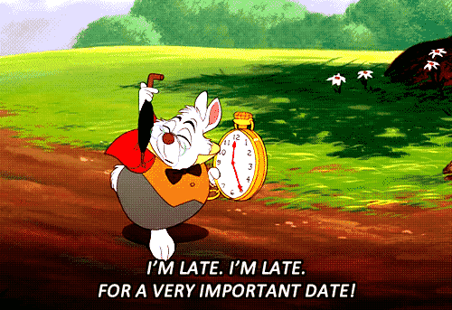
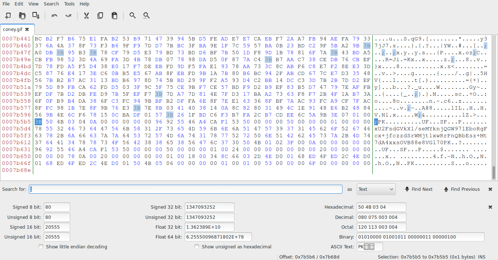

# sCTF 2015 Q1: Coney

**Points:** 65
**Description:**

None.

## Write-up

For this problem, you are given a GIF of the White Rabbit from _Alice's Adventures in Wonderland_.



GIF stands for Graphics Interchange Format. Every GIF should have a `;` as an end-of-file marker. Using a hex editor (such as Bless), you can check whether the last `;` of the file really is at the end of the file.



Nope, looks like there is something else at the end. If you work with ZIP files a lot (or do a quick Google search), you might realize that the `PK` immediately after the `;` is part of a ZIP file's signature. Copying the bytes of this ZIP into a new file and extracting it will give you one plaintext file called `x`.

`x` appears to contain some sort of ciphertext: 

```
U2FsdGVkX1/seMYknjQGW971EboRgFcx+jfczzdSrWMjt1xwRrPnQBbEsz+Mt7dA4xxsOVB88e8VGl70
```

The title of this problem is also a hint. A "coney" is another term for a "rabbit," which happens to be the name of a type of stream cipher. The ciphertext produced by this Rabbit cipher also looks similar to the one we found in `x`. [This](http://uttool.com/encryption/rabbit/default.aspx) was the implementation that we used.

Now you need a key. After overthinking this part, we tried `rabbit` and got the message, which was `The key is who_knew_there_is_a_rabbit_cipher`.

## Other write-ups and resources

* http://www.garykessler.net/library/file_sigs.html
* https://tools.ietf.org/html/rfc4503
